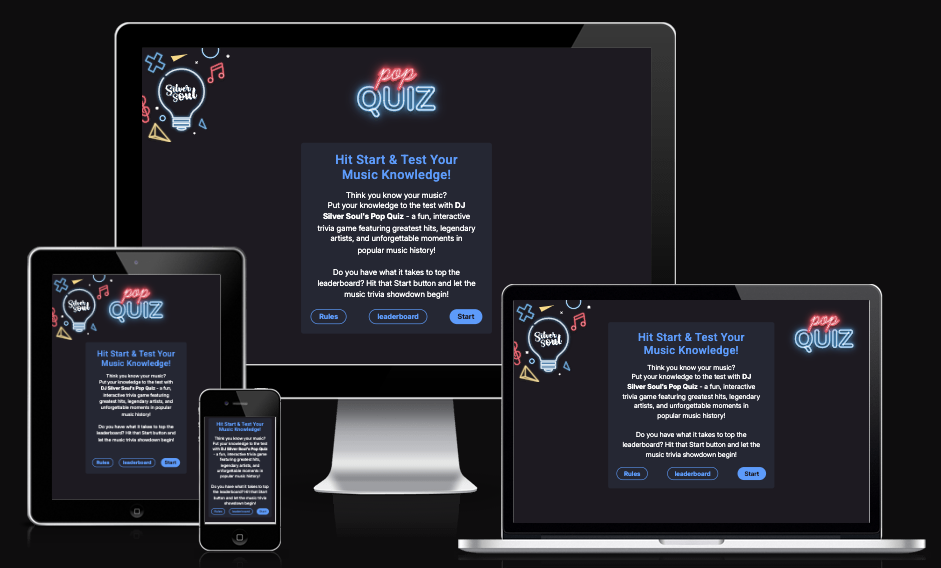

# Hi, I'm Steve - Full Stack Developer 👋 

<!--
**sd-powell/sd-powell** is a ✨ _special_ ✨ repository because its `README.md` (this file) appears on your GitHub profile.

Here are some ideas to get you started:

- 🔭 I’m currently working on ...
- 🌱 I’m currently learning ...
- 👯 I’m looking to collaborate on ...
- 🤔 I’m looking for help with ...
- 💬 Ask me about ...
- 📫 How to reach me: ...
- 😄 Pronouns: ...
- ⚡ Fun fact: ...
-->

I’m a passionate Web Application Developer currently working towards my Level 4 Diploma in Web Application Development. I enjoy building clean, efficient, and user-focused applications, with a particular interest in solving problems through code.

Always learning, always coding—feel free to check out my projects below!

 
- 🔭 I’m currently working on my **3rd Milestone Project**
 
- 🌱 I’m currently learning **Python + Django, MySQL/Postgres**

- 💬 Ask me about **HTML, CSS... or anything [here](https://github.com/sd-powell/sd-powell/issues)**

---

### ⚒️ Languages-Frameworks-Tools

 

### 🐍 My Contributions

### 📊 Stats
|  |  |
| :--: | :--: |

## Portfolio Sites

### DJ Silver Soul Pop Quiz
<a href="https://sd-powell.github.io/portfolio_project_2/"><a/>
🖼️ An interactive, disco-themed music trivia game where players race against the clock to test their knowledge and climb the leaderboard.
 
⚙️ Technologies Used - Javascript, HTML5, CSS
      

### DJ Silver Soul 🎧
<a href="http://www.djsilversoul.co.uk"><a/>
🖼️ Custom built responsive site to promote DJ Silver Soul, a DJ based in the South West. 
 
⚙️ Technologies Used - HTML5, CSS with Bootstrap.
      
